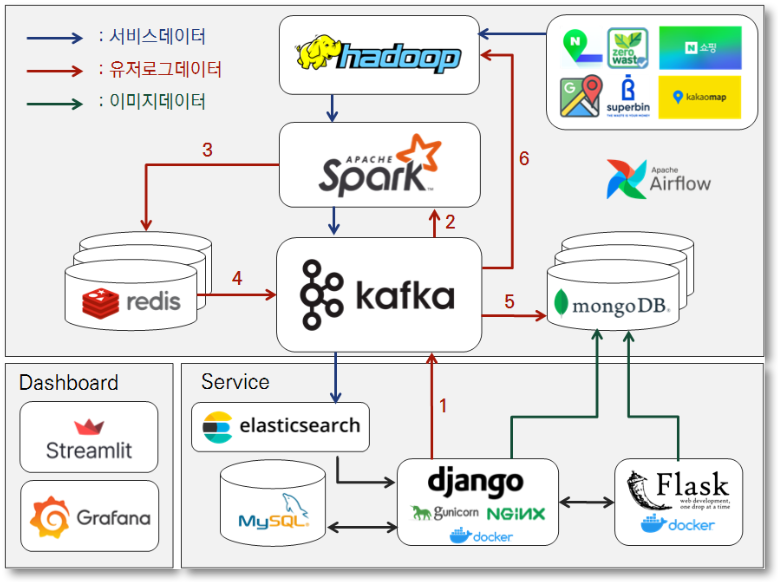
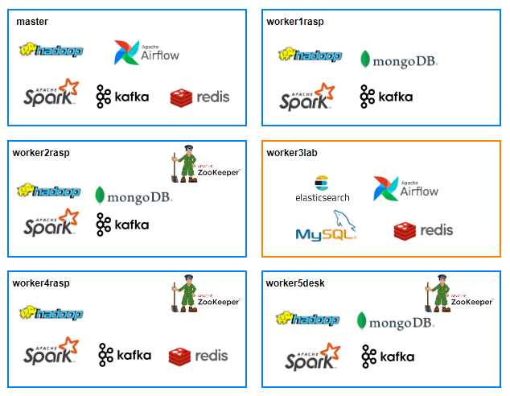
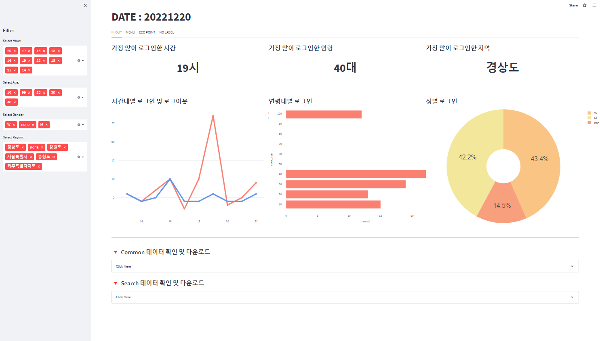
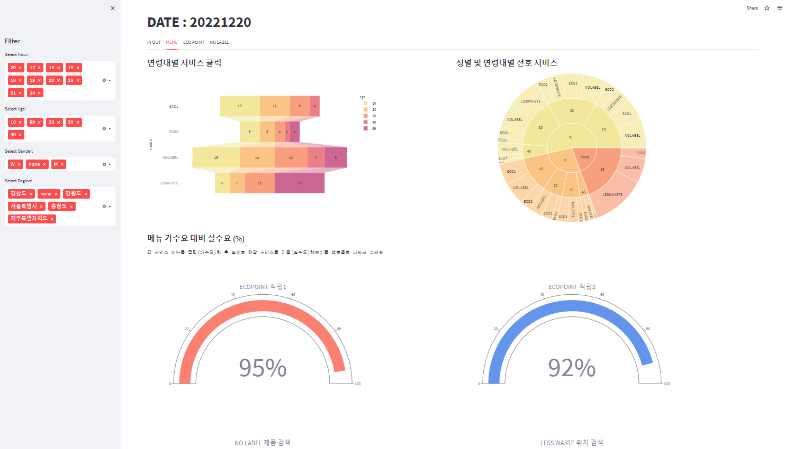
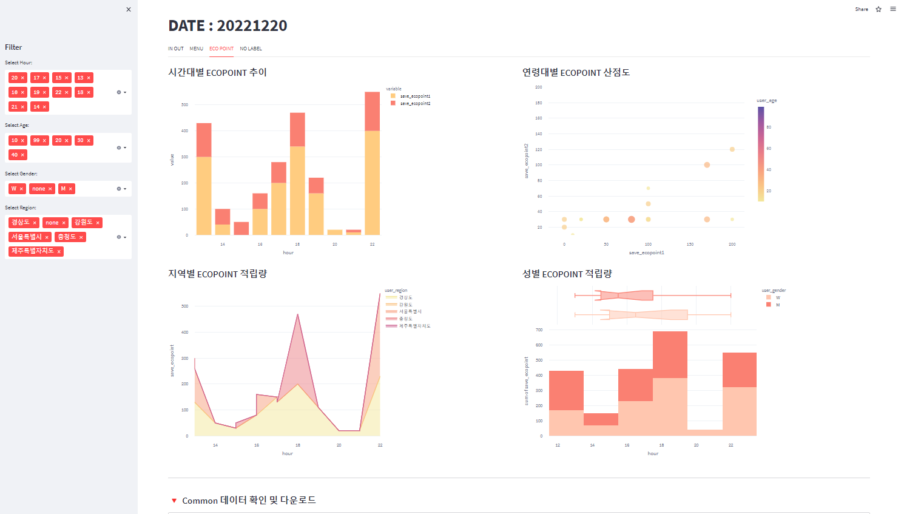
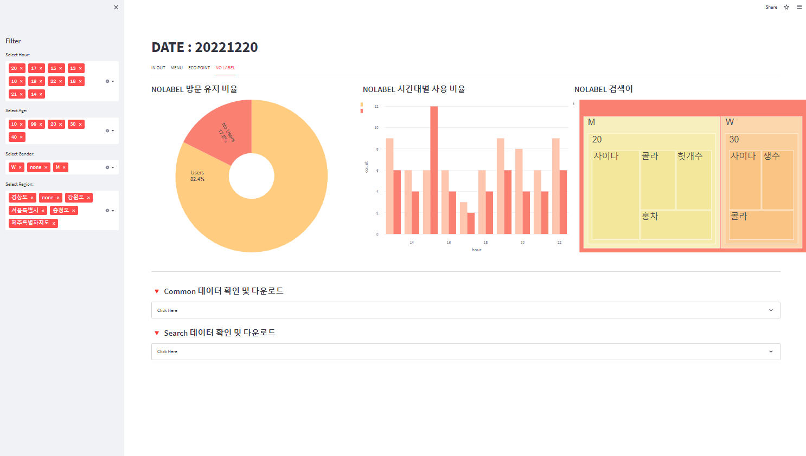
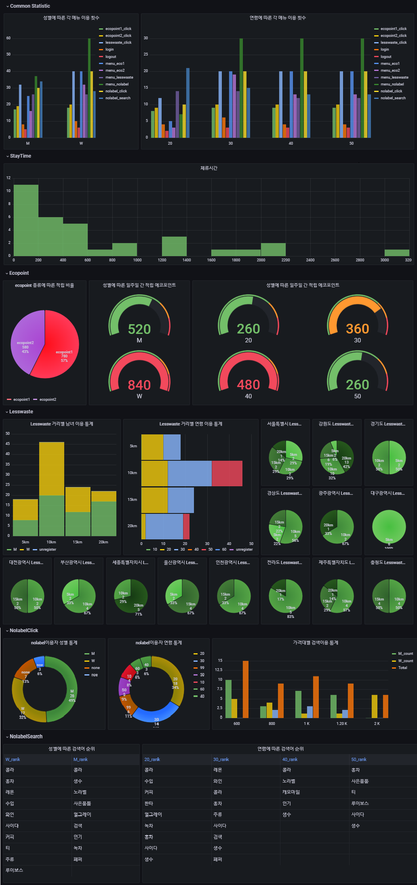

# Ciao label la 서비스 데이터 파이프라인 확장 및 재구축

---

- [1. 프로젝트 개요](#1-프로젝트-개요)
  - [1.1. 프로젝트 기간 및 팀 소개](#11-프로젝트-기간-및-팀-소개)
  - [1.2. 프로젝트 소개](#12-프로젝트-소개)
- [2. 프로젝트 설계](#2-프로젝트-설계)
  - [2.1. 아키텍처 정의서](#21-아키텍처-정의서)
  - [2.2. 클러스터 노드 정의서](#22-클러스터-노드-정의서)
- [3. 파이프라인 확장 및 보완](#3-파이프라인-확장-및-보완)
  - [3.1. 유저 로그 데이터](#31-유저-로그-데이터)
  - [3.2. 유저 업로드 이미지 데이터](#32-유저-업로드-이미지-데이터)
- [4. 서비스 고도화](#4-서비스-고도화)
  - [4.1. 무라벨 제품 조회 서비스 업데이트](#41-무라벨-제품-조회-서비스-업데이트)
  - [4.2. 유저 맞춤형 실시간 검색어 제공](#42-유저-맞춤형-실시간-검색어-제공)
  - [4.3. 악성 유저 대처](#43-악성-유저-대처)
- [5. 서비스 화면](#5-서비스-화면)
  - [5.1. 서비스 메인 페이지](#51-서비스-메인-페이지)
  - [5.2. 서비스 소개 페이지](#52-서비스-소개-페이지)
  - [5.3. Ecopoint1 페이지](#53-ecopoint1-페이지)
  - [5.4. Ecopoint2 페이지](#54-ecopoint2-페이지)
  - [5.5. No Label 페이지](#55-no-label-페이지)
  - [5.6. Less Waste 페이지](#56-less-waste-페이지)
  - [5.7. 마이페이지](#57-마이페이지)
  - [5.8. 회원가입 페이지](#58-회원가입-페이지)
  - [5.9. 로그인 페이지](#59-로그인-페이지)

---

## 1. 프로젝트 개요

### 1.1. 프로젝트 기간 및 팀

- 1차 프로젝트 : 2022.08.18 ~ 2022.09.30
  - [Ciao label la ver.1 포트폴리오 바로 가기](https://github.com/hanna-joo/PJT_Ciaolabella1)
- 2차 프로젝트 : 2022.10.12 ~ 2022.12.21
  - [Ciao label la ver.2 서비스 바로 가기](https://ciaolabella.site/)
  - [Ciao label la ver.2 기술 공유 노션 바로 가기](https://www.notion.so/Ciaolabella-4b32bd0e550a4414922b89975965cc7d)
  - Team Ozi : [고유정](https://github.com/yu-je0ng), [김세진](https://github.com/nijes), [류재선](https://github.com/prudent-PS), [이경덕](https://github.com/Kyung-Deok), [주한나](https://github.com/hanna-joo)

### 1.2. 프로젝트 소개

>  기존 Ciao label la 서비스를 확장하여,
>
> 1. 파이프라인 확장 및 보완
>
>    - 유저 로그를 세분화하여 설계·수집·집계·적재·시각화하는 파이프라인 구축
>
>    - AI 모델 재학습을 위한 유저 업로드 이미지 및 모델 결과 수집
>
>    - 확장성과 안정성을 고려한 클러스터 구축
>
> 2. 서비스 고도화
>    - 주기적인 서비스 업데이트를 위한 스케쥴링
>    - 악성 유저 대처 및 유저 맞춤형 실시간 검색어 제공

 

## 2. 프로젝트 설계

### 2.1. 아키텍처 정의서

  

| Category          | Name            | Version    |
| ----------------- | --------------- | ---------- |
| Environment       | AWS EC2         | free tier  |
|                   | Ubuntu          | 20.04      |
| Big Data Platform | Kafka           | 2.12-3.2.0 |
|                   | Zookeeper       | 3.8.0      |
|                   | Hadoop          | 3.3.3      |
|                   | Spark           | 3.1.3      |
|                   | Elasticsearch   | 7.17.5     |
|                   | Airflow         | 2.5.0      |
| Database          | MySQL           | 8.0.31     |
|                   | MongoDB         | 4.4.5      |
|                   | Redis           | 7.0.5      |
| Web Development   | Flask           | 2.2.2      |
|                   | Django          | 3.2.16     |
|                   | Nginx           |            |
|                   | Docker          |            |

### 2.2. 클러스터 노드 정의서

 

## 3. 파이프라인 확장 및 보완

### 3.1. 유저 로그 데이터

**유저 로그 데이터 플로우**

* 유저 로그 데이터 활용도에 따른 구분 및 저장
  * `Hot data` : 당일 발생한 로그 데이터 (실시간 시각화 및 분석 용도)
  * `Warm data` : 최근 일주일 치 로그 데이터 (체류시간 포함 일주일 치 시각화 및 분석 용도)
  * `Cold data` : 과거 모든 로그 데이터 (향후 분석 및 백업 용도)
* **Hot Data**
  * 원본 로그
    * Django 에서 수집한 원본 로그 데이터를 1차적으로 데이터허브인 Kafka 에 저장
  * 실시간 로그 집계
    * Spark-streaming을 통하여 실시간 데이터에 대해 1분 또는 5분 단위로 집계하여 Redis 에 저장
    * Redis-Streamlit 을 통한 시각화 대시보드
  * 배치 로그 집계
    * Spark 을 통하여 당일 발생 로그에 대해 집계본을 만들어 Kafka 에 저장
* **Warm Data**
  * Redis 에 저장된 전날 발생한 실시간 로그 집계 데이터를 2차적으로 Kafka에 저장
  * 최근 일주일치 발생한 로그 집계 데이터를 Kafka 에서 MongoDB에 저장
  * MongoDB-Grafana를 통한 시각화 대시보드
* **Cold data**
  * 전체 데이터를 Hadoop에 csv 형식으로 저장
* **Airflow 를 통하여 데이터 플로우 자동화**

**Redis 로그 시각화 대시보드**

**MongoDB 로그 데이터 시각화 대시보드**

### 3.2. 유저 업로드 이미지 데이터 수집

* Django 서비스에서 유저가 업로드한 이미지 원본을 grifs를 이용하여 mongodb에 저장
* Flask app에서 원본 이미지에 대한 yolov5모델 결과가 포함된 이미지를 grifs를 이용하여 mongodb에 저장 

 

## 4. 서비스 고도화

### 4.1. 무라벨 제품 조회 서비스 업데이트

* 파이썬 스크립트를 통하여 웹에서 nolabel 제품데이터 크롤링 후 원본 hadoop에 적재
* spark를 통한 원본 데이터 가공 후 Kafka 적재 후 es 저장
* 매주 일요일 02:00 데이터 업데이트 되도록 Airflow를 통한 스케쥴링

### 4.2. 유저 맞춤형 실시간 검색어 제공

**구현 방안**

- `1단계` : 무라벨 제품 검색 서비스에서 발생하는 검색어 로그 수집
- `2단계` : Spark-streaming 을 통하여 실시간 집계 후 인메모리 저장소인 Redis 에 저장
- `3단계` : 마이페이지에서 해당 회원의 성별과 연령대에 해당하는 검색어 조회 및 표시

**구현 결과**

### 4.3. 악성 유저 대처

- 동일한 이미지를 여러 번 올려 에코포인트를 적립하려는 유저에 대응하기 위한 조치로 다음과 같이 개편하였다

  - 당일에 찍은 사진만 업로드 가능
    - 업로드한 이미지의 메타 데이터를 활용
  - 동일한 이미지 업로드 불가능
    - 업로드한 이미지 아이디 저장 후 새로 업로드한 이미지와 비교
  - 하루 에코 포인트 적립 횟수 각 에코포인트 적립 서비스 당 2회 제한
    - Redis 캐시에 에코 포인트 적립 횟수 저장

 

## 5. 서비스 화면

### 5.1. 서비스 메인 페이지

### 5.2. 서비스 소개 페이지

### 5.3. Ecopoint1 페이지

### 5.4. Ecopoint2 페이지

### 5.5. No Label 페이지

### 5.6. Less Waste 페이지

### 5.7. 마이페이지

### 5.8. 회원가입 페이지

### 5.9. 로그인 페이지

